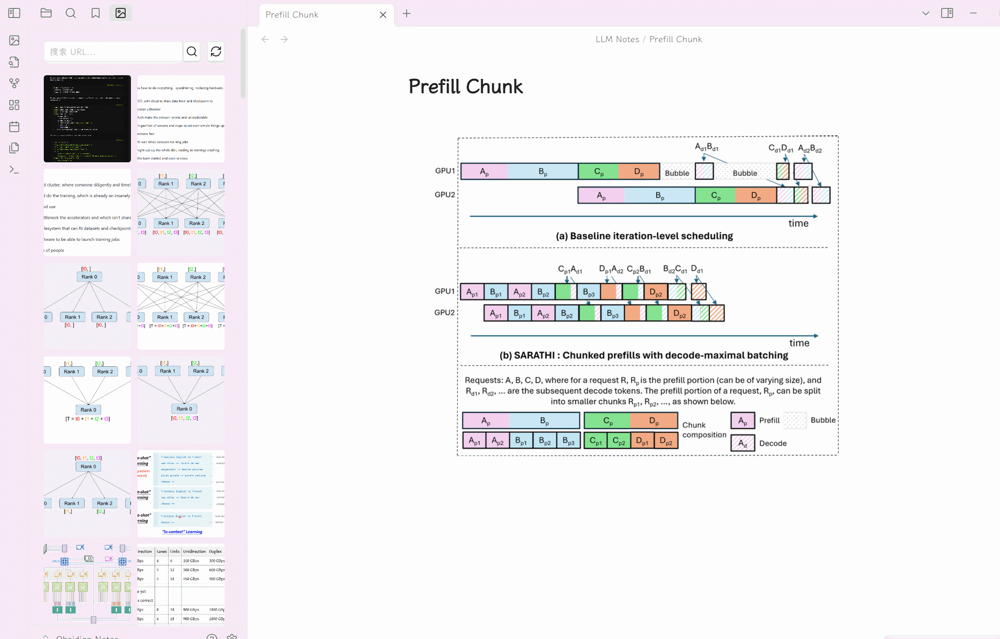
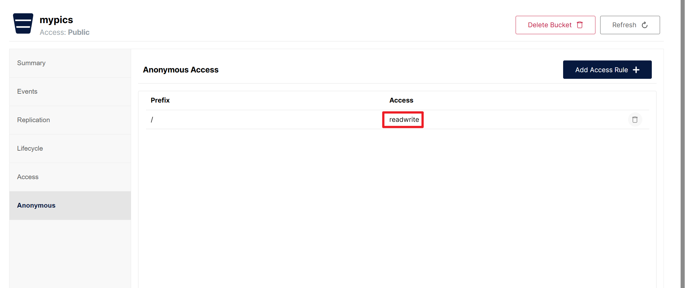

# Obsidian Minio Plus Plugin

### [English](./README.md) | 中文

这个仓库是从 [Obsidian Minio Uploader Plugin](https://github.com/seebin/obsidian-minio-uploader-plugin) fork 过来的，并添加了一些新功能。

## 新功能
- 支持基础路径
- 支持自定义域名
- 支持图片库视图
  - 网格布局查看所有已上传图片
  - 通过 URL 搜索图片
  - 一键复制图片 URL
  - 直接从图片库中删除图片
  - 全屏预览图片

## 特性
- 支持拖拽文件到编辑器后直接上传到 Minio
- 支持粘贴文件到编辑器后直接上传到 Minio
- 支持多种文件类型预览：
  - 图片预览
  - 视频预览
  - 音频预览
  - 文档预览（Google Docs/Office Online）
- 智能图片库优化：
  - LRU 缓存策略提升性能
  - 懒加载优化（Intersection Observer）
  - 回到顶部按钮
  - 批量渲染优化
  - 内存管理和清理
- 增强图片预览体验：
  - 硬件加速的流畅动画
  - 点击背景关闭预览
  - ESC 键退出预览
  - 优化拖拽性能

---

## 设置

首先，Minio 相关配置都必须正确配置后才可以正常使用：

> 提示：端口号为 Minio 的 API 数据访问端口号

- accessKey
- secretKey
- bucket
- endpoint
- port
- SSL
- Base path (Optional)
- Custom domain (Optional)

其次，需要在 Minio 控制台的 Bucket 设置中开启文件匿名访问能力，即通过 URL 可直接访问文件。

