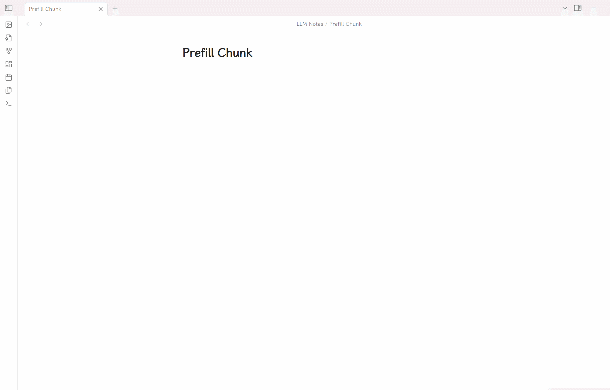
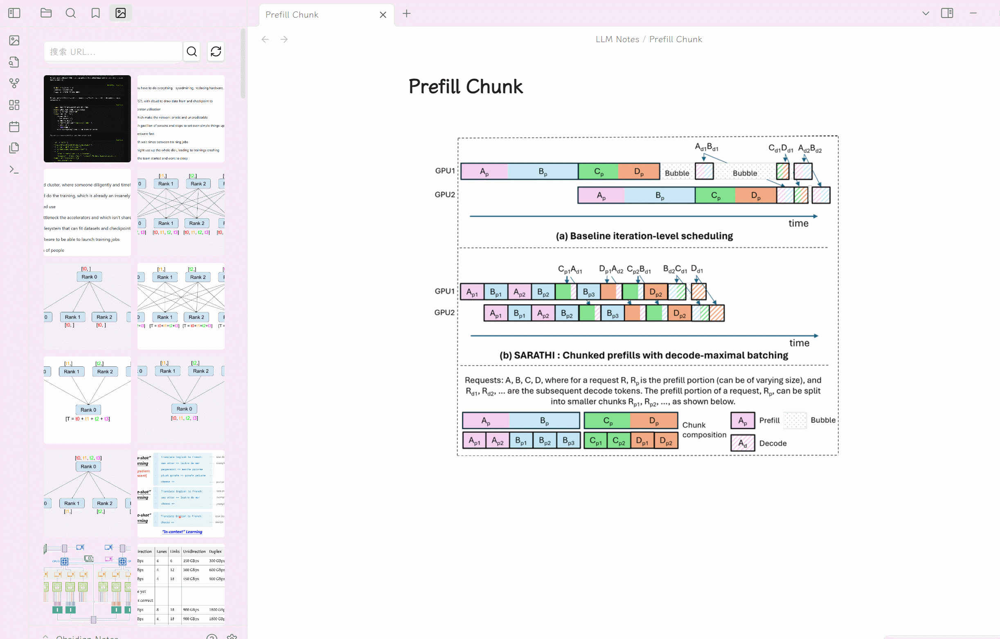
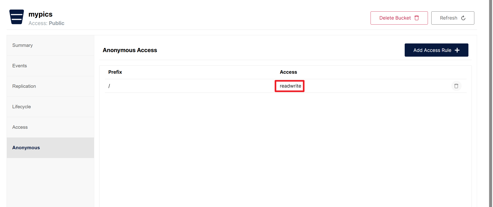

# Obsidian Minio Plus Plugin

### English | [中文](./README-zh.md)

This repository is forked from [Obsidian Minio Uploader Plugin](https://github.com/seebin/obsidian-minio-uploader-plugin) and added some new features.

## New Features
- Support base path
- Support custom domain
- Support image gallery view
  - View all uploaded images in a grid layout
  - Search images by URL
  - Copy image URL with one click
  - Delete images directly from the gallery
  - Preview images in full screen

## Features
- Supports dragging and dropping files to the editor and directly uploading them to Minio
- Support for directly uploading files to Minio after pasting them into the editor
- Support preview for various file types:
  - Image preview
  - Video preview
  - Audio preview
  - Document preview (Google Docs/Office Online)

---

## Setting

Firstly, all Minio related configurations must be correctly configured before they can be used normally:

>Tip: API data access port number for Minio

- accessKey
- secretKey
- bucket
- endpoint
- port
- SSL
- Base path (Optional)
- Custom domain (Optional)

Secondly, it is necessary to enable anonymous access to files in the Bucket settings of the Minio console, which means that files can be directly accessed through URLs.

